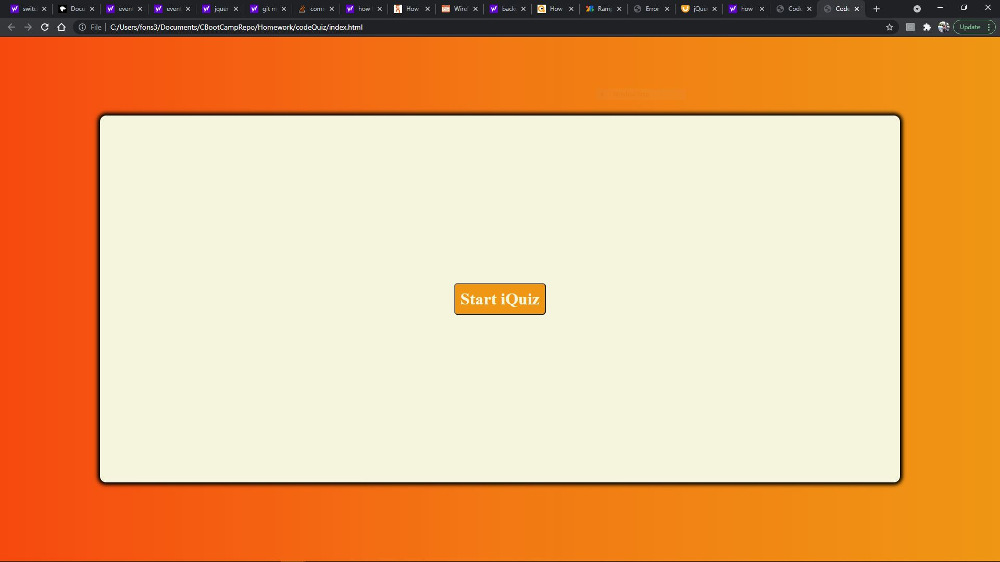
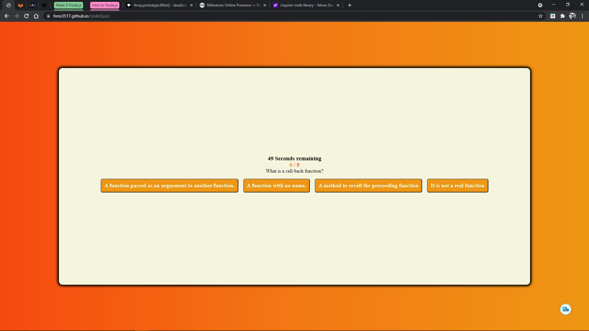
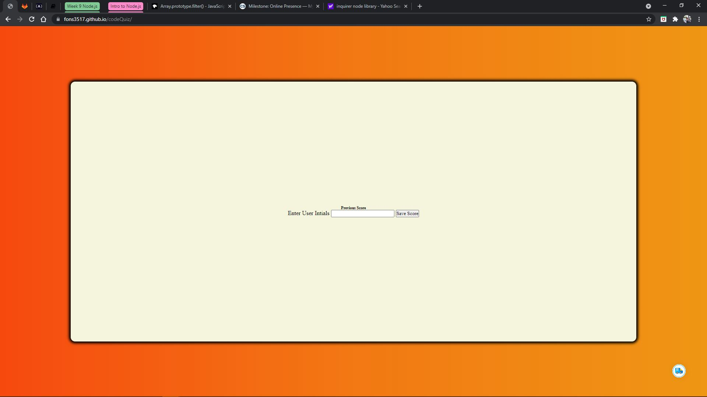

# Code iQuiz

* Due date: 08/21/2021

## Code iQuiz:

* This coding quiz is a timed quiz. You have exactly 60 seconds to complete the quiz. It will begin once you have clicked the Start button and will end at your completion or once your 60 seconds have expired. Your score will be recorded and you have the option to record you initials as well. Best of luck!!!

### Link to deployed site; screenshot of up-to-date site included.

[CodeQuizHomework](https://fons3517.github.io/codeQuiz/)

**Alfonso Robles 08/21/21**
